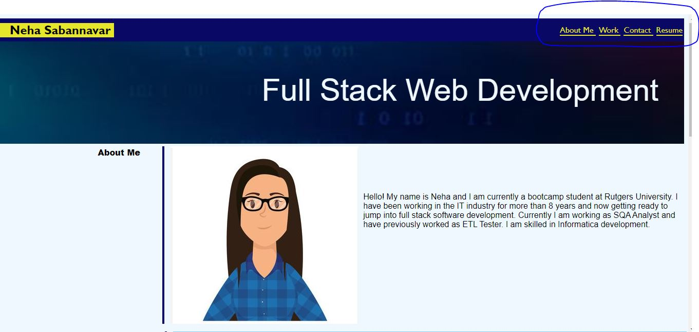
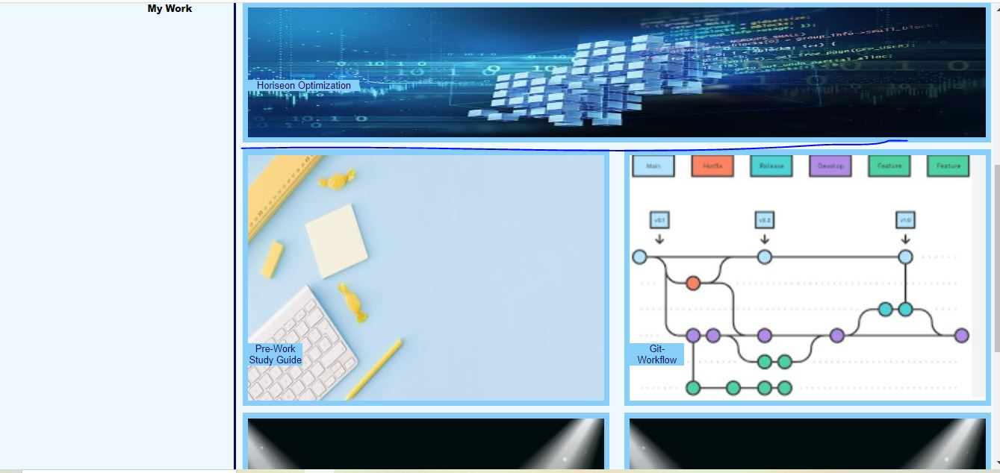
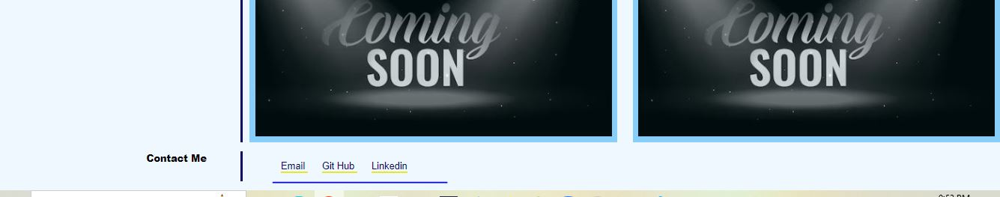

# Neha Sabannavar Portfolio

## Profile

My motivation behind creating this simple portfolio page was to showcase my skill set to employers.
It consolidates my work (small github projects) and contact details in a single web page.
While developing this page, I came across many simple animations which CSS provides to make it more user friendly. I tried to use them here. (example: pseudo class, media screen and flex etc)

## Installation
Browser to open the link:
Click on the navigation link, it will take you to the respective section

Hover over the work section images and click it to get details about it

Click on the contact link, it will open up the respective link in new tab

## Credits
W3schools: https://www.w3schools.com/css/default.asp
CSS Tricks: https://css-tricks.com/snippets/css/a-guide-to-flexbox/
Geeks For Geeks: https://www.geeksforgeeks.org/
MDN Web Docs: https://developer.mozilla.org/en-US/docs/Web/CSS/gradient/linear-gradient
Image for gudiance from boot-camp GitLab repository: https://git.bootcampcontent.com/Rutgers-University/RUT-VIRT-FSF-PT-06-2023-U-LOLC/-/tree/main/02-Advanced-CSS/02-Challenge
Rutgers TA and AskBCS

##License
Licensed under MIT

